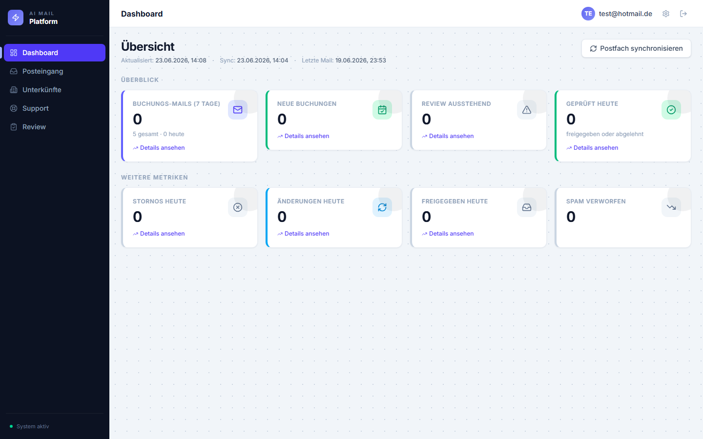
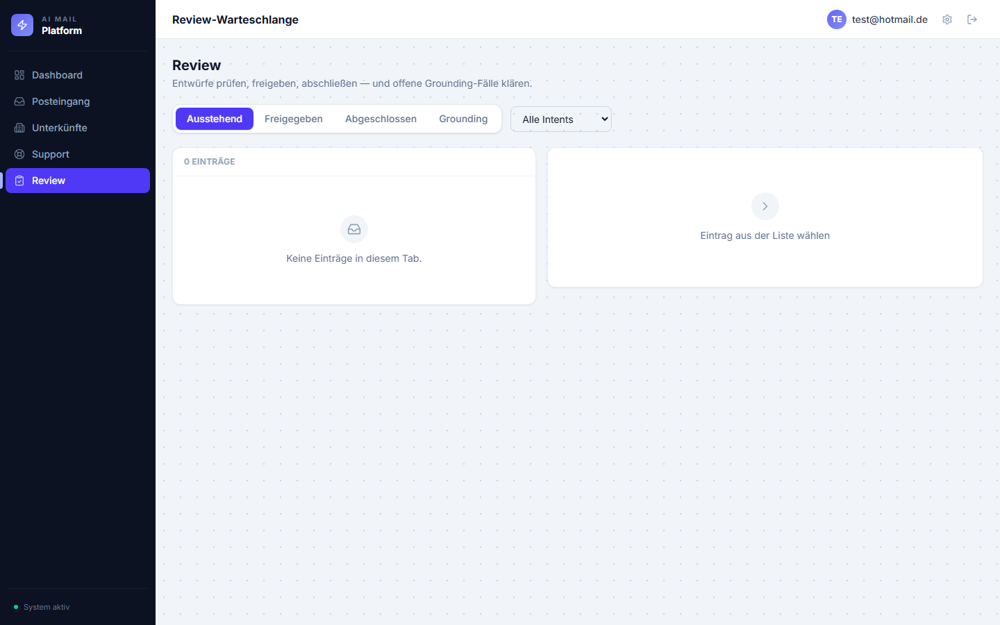
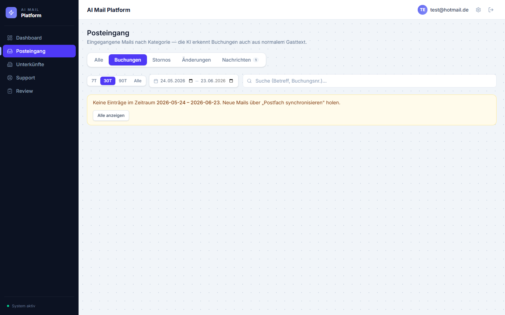
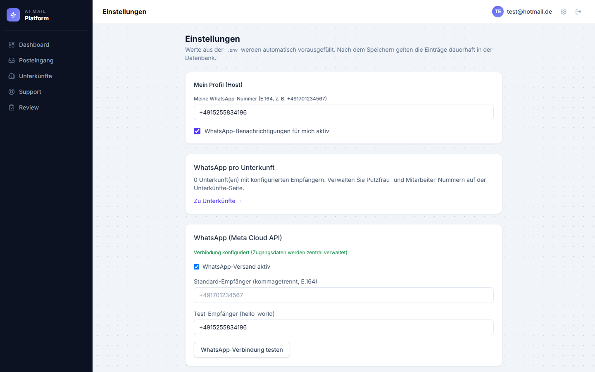
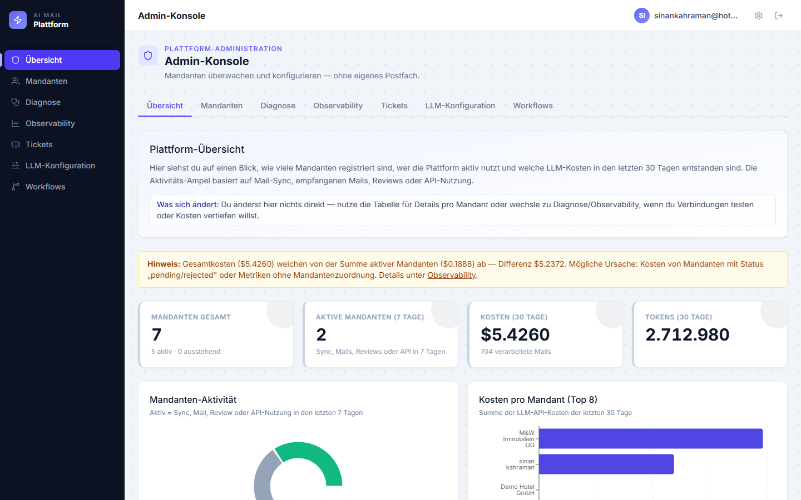
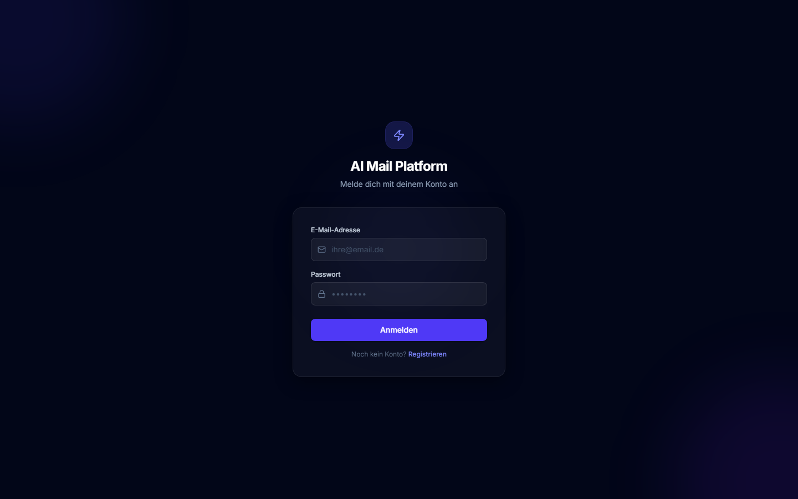
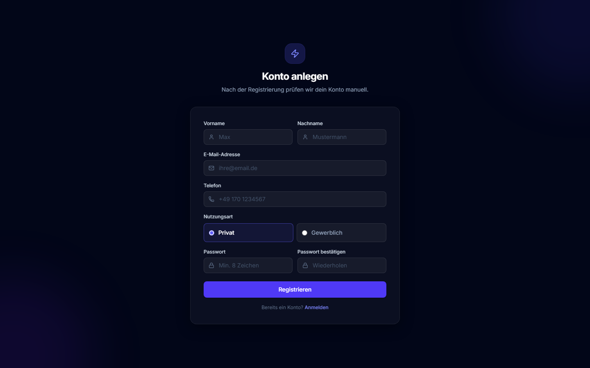

# Booking Email Platform

AI-powered processing of incoming booking emails with human approval — no automatic sending. Built for vacation rental hosts (Airbnb, Booking.com, Expedia, VRBO, direct bookings).

**Live:** [booking-email-check-production.up.railway.app](https://booking-email-check-production.up.railway.app)

---

## What the platform does

| Feature | Description |
|---|---|
| **Mail polling** | Automatically fetches new mail every 5 min via IMAP or Microsoft Outlook |
| **AI pipeline** | Classifies, extracts booking data, drafts a reply |
| **Review queue** | Drafts wait for human approval — **no auto-send** |
| **WhatsApp alerts** | Notifies host + cleaning team via WhatsApp on new bookings |
| **WhatsApp webhook** | Replies from the cleaning team are automatically forwarded to the host |
| **Multi-tenant** | Multiple host accounts with full data isolation |
| **Onboarding** | Self-service mailbox setup (IMAP or Outlook OAuth) |

---

## Dashboard (UI)

The React dashboard bundles tenant and platform views: KPIs, mail lists,
human review and an admin console.

| View | Screenshot |
|---------|------------|
| Tenant dashboard (KPIs, sync) |  |
| Review queue (approve drafts) |  |
| Inbox (intent tabs) |  |
| Settings (WhatsApp, mailbox) |  |
| Platform admin (tenants & costs) |  |
| Login & registration |  ·  |

Regenerate screenshots:

```powershell
# Production (Railway) – ADMIN_EMAIL / ADMIN_PASSWORD from .env;
# optionally TENANT_EMAIL / TENANT_PASSWORD for tenant views
cd frontend
npm run screenshots:production

# Locally with demo data (without Atlas):
# Terminal 1: .\.venv\Scripts\python scripts\screenshot_demo_server.py
# Terminal 2: cd frontend && npm run screenshots:demo
```

---

## Tech Stack

| Area | Technology |
|---|---|
| Backend | Python 3.11, Flask, LangGraph, Pydantic |
| AI | OpenAI GPT-4o-mini (classification, extraction, drafting) |
| Database | MongoDB Atlas (documents + vector search) |
| Observability | Langfuse |
| Frontend | React 19, TypeScript, Vite, Tailwind CSS 4 |
| Deployment | Railway, Docker, Gunicorn, GitHub Actions CI |
| Notifications | Meta WhatsApp Cloud API |

---

## Architecture

```
backend/
├── api/            # Flask blueprints, JWT auth, rate limiting
├── ai/             # LangGraph workflow, LLM services, prompts, domain packs
├── features/       # Mail polling, WhatsApp notifications, platform admin
├── infrastructure/ # MongoDB repositories, Outlook Graph adapter
├── core/           # Config, Pydantic models, utils
└── application/    # Ingestion & review ports

frontend/src/
├── features/       # Screens (dashboard, inbox, review, properties, settings, onboarding)
├── shared/         # UI components, layout
└── lib/            # API clients, TypeScript types
```

**Tenant navigation:** `Dashboard · Inbox · Properties · Support · Review`.
The **Inbox** bundles all mail categories as intent tabs (All / Bookings / Cancellations /
Changes / Messages); **Review** unifies the approval lifecycle as tabs
(Pending / Approved / Completed / Grounding).

Import direction is strictly top-down: `api → features → ai → infrastructure → core`. Max. 300 lines per file (CI-enforced).

---

## Local development

**Prerequisites:** Python 3.11, Node.js 20, MongoDB Atlas, OpenAI API key, Langfuse

```bash
# Backend
python3.11 -m venv .venv && .venv\Scripts\activate   # Windows
pip install -e ".[dev]"
pre-commit install && pre-commit install --hook-type commit-msg
cp .env.example .env   # add API keys

# Create admin account + start backend
python scripts/seed_admin.py
flask --app backend.api.app:create_app run --debug --port 5000

# Frontend (second terminal)
cd frontend && npm install && npm run dev
```

Browser: `http://localhost:5173`

---

## Deployment (Railway)

Every push to `main` triggers a deploy automatically.

**Required variables in Railway:**

```
OPENAI_API_KEY          OpenAI API key
MONGODB_URI             Atlas connection string
FLASK_SECRET_KEY        openssl rand -hex 32
ADMIN_EMAIL             Admin login
ADMIN_PASSWORD          Admin password
LANGFUSE_PUBLIC_KEY     Langfuse key
LANGFUSE_SECRET_KEY     Langfuse secret
APP_ENV                 production
FLASK_ENV               production
CORS_ORIGINS            https://booking-email-check-production.up.railway.app
```

**Optional variables:**

```
WHATSAPP_ENABLED                true
WHATSAPP_ACCESS_TOKEN           Meta system user token (permanent)
WHATSAPP_PHONE_NUMBER_ID        Meta phone number ID
WHATSAPP_WEBHOOK_VERIFY_TOKEN   Your own secret string for webhook verification
AZURE_CLIENT_ID                 For Outlook OAuth
AZURE_CLIENT_SECRET             For Outlook OAuth
OUTLOOK_OAUTH_REDIRECT_URI      https://…/api/mail/outlook/callback
```

**Once after the first deploy:**
```bash
railway run python scripts/seed_admin.py
```

---

## Setting up the WhatsApp webhook

So that replies from the cleaning team are automatically forwarded to the host:

1. [Meta Developer Portal](https://developers.facebook.com) → App → WhatsApp → Configuration
2. Callback URL: `https://booking-email-check-production.up.railway.app/api/whatsapp/webhook`
3. Verify token: same value as `WHATSAPP_WEBHOOK_VERIFY_TOKEN` in Railway
4. Subscribe to the **`messages`** webhook field

---

## Tests & quality

```bash
pytest -q                              # all unit tests
pytest -m integration                  # requires MONGODB_URI
python scripts/check_max_file_lines.py # 300-line limit
ruff check . && black --check . && mypy .
```

CI runs on every push: Ruff, Black, MyPy, Pytest, TypeScript build.

---

## Documentation

| File | Content |
|---|---|
| [`docs/ARCHITECTURE.md`](docs/ARCHITECTURE.md) | Layers, import rules, entrypoints |
| [`docs/SPEC.md`](docs/SPEC.md) | Functional specification |
| [`docs/OUTLOOK.md`](docs/OUTLOOK.md) | Microsoft Graph / OAuth setup |
| [`docs/LANGFUSE.md`](docs/LANGFUSE.md) | Tracing and observability |
| [`docs/GEMINI.md`](docs/GEMINI.md) | Gemini multimodal (workflow sandbox) |
| [`docs/ROADMAP.md`](docs/ROADMAP.md) | Planned features |
| [`docs/USER_SETUP.md`](docs/USER_SETUP.md) | User onboarding guide |
| [`docs/images/`](docs/images/) | Architecture diagrams and UI screenshots |
| [`CLAUDE.md`](CLAUDE.md) | Project rules for AI agents |

---

## Security

- No secrets in the repository — environment variables only
- PII is masked before Langfuse traces (`backend/core/utils/pii_mask.py`)
- No automatic email sending — every draft requires human approval
- All API endpoints are JWT-protected with account scope checks
